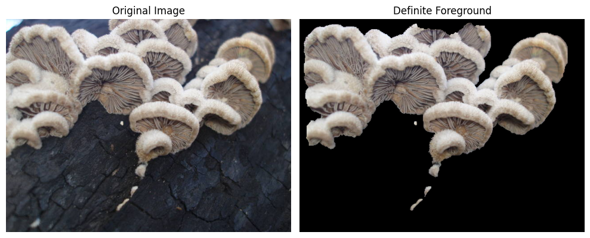

# Mushroom Classification

A course project that compares MobileNetV3-Small transfer-learning classifiers trained on original versus GrabCut-preprocessed mushroom images.

This academic experiment is not suitable for deciding whether a specimen is safe to eat.

## What the label means

`labels.csv` contains manual binary annotations. The dataset inverts them before training: target `1` means **not annotated as edible** and target `0` means `edible=True`. The `False` group includes lichens and species with unknown or ambiguous edibility; it is not a verified poisonousness label. Per-species annotation sources were not recorded in the repository.

## Historical experiment record

The notebook retains output from one recorded run in [the original repository state](https://github.com/Eb3ls/mushroom_classification/tree/28d05982f5f4017023119706bd2c68539d193794). It selected 15 `edible=True` and 15 `edible=False` species independently in each provided split, then sampled up to 100 images per species: 3,000 rows each for train, validation, and test. The code does not enforce identical species membership between splits.

| Historical test metric | EXP1: original | EXP2: GrabCut |
| --- | ---: | ---: |
| Accuracy | 0.7233 | 0.7127 |
| Precision for the project-defined positive class | 0.7414 | 0.7200 |
| Recall for the project-defined positive class | 0.6860 | 0.6960 |
| F1 for the project-defined positive class | 0.7126 | 0.7078 |
| False positives | 359 | 406 |
| False negatives | 471 | 456 |

These are historical single-run measurements, not replicated results. The seed was set once, but the recorded initialization, data-loader randomness, and augmentations were not established as matched across the two runs; no uncertainty estimates or significance tests were performed. The numbers therefore do not establish a general benefit of either pipeline or a safety effect. A local synthetic smoke test validates the current code path only; it does not reproduce the historical accuracy.

The saved outputs report 689,520 training rows, 15,616 validation rows, and 15,614 test rows before reduction. The 9,000-row experiment subset is distinct from those source metadata splits.

## Segmentation

The notebook explores several classical segmentation ideas. The recorded EXP2 dataset was generated by `apply_grabcut` with a cropped rectangle initializer and `iters=2`, run through `ThreadPoolExecutor`; it did not use the notebook’s exploratory superpixel/Otsu-guided `advanced_grabcut` routine. Qualitative notebook plots are exploratory visualizations, not segmentation-quality validation.



*Historical notebook visualization extracted from the recorded output; it illustrates the basic GrabCut preprocessing path and is not a new validation result.*

## Running the project

Use Python 3.11–3.13; local execution checks use Python 3.12 on Linux with CPU-only PyTorch. Start in an isolated environment:

```bash
git clone https://github.com/Eb3ls/mushroom_classification.git
cd mushroom_classification
python -m venv .venv
```

Activate it with `source .venv/bin/activate` on Linux/macOS, or `.venv\Scripts\Activate.ps1` in Windows PowerShell. On Linux or Windows, install the CPU PyTorch wheels first, then the remaining direct dependencies:

```bash
python -m pip install torch==2.9.1 torchvision==0.24.1 --index-url https://download.pytorch.org/whl/cpu
python -m pip install -r requirements.txt
```

For CUDA, use the matching official command from [PyTorch’s v2.9.1 installation instructions](https://pytorch.org/get-started/previous-versions/#v291). Apple Silicon uses the regular PyPI installation path; macOS and Windows were not validated locally. CUDA is optional; the notebook selects CUDA only when it is available.

The notebook downloads [Mushroom1](https://www.kaggle.com/datasets/zlatan599/mushroom1) through `kagglehub`. Its files are large and a full download or retraining is not part of the repository’s local smoke-test workflow. The Color Names exploration requires a `w2c.mat` asset; cells that depend on it are optional if the asset is absent.

Launch `jupyter lab main.ipynb` from the repository directory and use the kernel from this environment. Running all cells downloads the dataset and pretrained weights, processes the selected images, and trains both experiments. The optional Color Names cells skip automatically when `w2c.mat` is absent; this does not prevent the GrabCut experiments from running.

Generated preprocessing caches are reused only when their rows, annotations, parameters, and readable output files match the request. Older manifests regenerate once. Processing errors stop the run instead of silently retaining invalid image paths. The original tiny-foreground fallback still warns and retains the source image.

Run the available tests with:

```bash
python -m unittest discover -s tests -v
```

## Scope and limitations

The selected sample is artificially balanced and comes from one source collection. Segmentation masks were not evaluated against reference masks, and the classifier was not evaluated on an independent real-world collection. Repeated runs, annotation provenance, and external validation would be needed for stronger conclusions.

## Authors

Leonardo Berselli & Thomas Ottonello — Master in AI Systems, University of Trento (2025)
*Signal, Image and Video Processing course*
